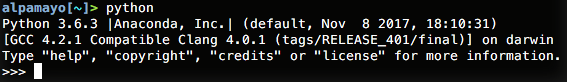

# Lab 1

## Installs and Setup

### Git and Github
Do you have a GitHub account?

Git configuration:

- Who are you? `git config --global user.name "Eli Ben-Michael"`
- How can I reach you? `git config --global user.email ebenmichael@berkeley.edu`

Can change much more: editor, coloring, etc.

### Anaconda
What is Anaconda?

- A Python distribution
- An environment manager
- A package manager

#### A Python distribution

- Install Anaconda from the download
- Open python by typing in `python` into the shell. Should see something like



- Make sure you're using Anaconda's python. If not, open `~/.bashrc` and add

```
export PATH="/home/$USERNAME/anaconda3/bin:$PATH"
```

#### An environment manager

An environment is a standalone version of python which you can make changes to without affecting your global system python.

- Create an environment with Python 3.6 and a few packages for this class:
`conda create -n stat159 python=3.6 numpy scipy matplotlib`
- To activate the environment:
    - Linux/Mac: `source activate stat159`
	- Windows: `activate stat159`
- To deactivate the environment:
    - Linux/Mac: `source deactivate`
	- Windows: `deactivate`


#### A package manager

- Add a package (pandas) to the environment

```
source activate stat159
conda install pandas
```

### Playing with python
Some code to create and plot random data

```python
import numpy as np
import matplotlib.pyplot as plt
n = 1000
x = np.random.randn(n)
y = x ** 2 - 10 * x + 2 + np.random.randn(n)
plt.scatter(x,y)
plt.show()
```

Try running this code with
- The basic interpreter: `python`
- The Jupyter console `jupyter console`
- In a Jupyer notebook: `jupyter notebook`

#### Whirlwind Tour of Python
A good reference on Python that we will be using is [A Whirlwind Tour of Python](http://www.oreilly.com/programming/free/files/a-whirlwind-tour-of-python.pdf) by Jake VanderPlas. The book has a [collection of Jupyter notebooks](https://github.com/jakevdp/WhirlwindTourOfPython) to run through.

Start by cloning the repo:

```
git clone https://github.com/jakevdp/WhirlwindTourOfPython.git
```

Then try to run through the notebooks, changing the code yourself.

### Loose Ends
Be sure to [install Visual Studio Code](https://code.visualstudio.com/download) if you don't have an editor that you already like. Also create an [Overleaf Account](https://www.overleaf.com) for collaboration.

### Survey
[Please complete the survey](https://goo.gl/forms/PrbaWcyBi1lEXzEi2) 
(Shortened url: http://bit.ly/2vpsNqu)
